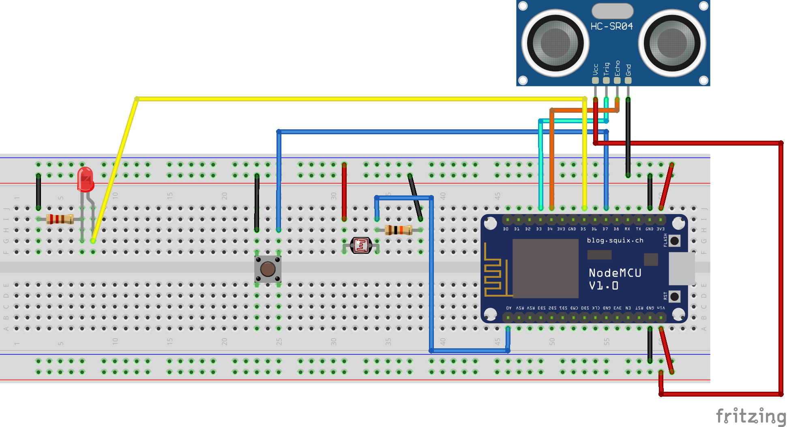
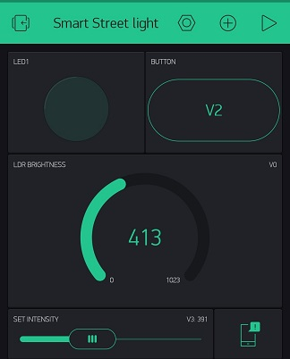

# SMART STREET LIGHT USING BLYNK

## Components/Sensors required for this Project

1. HC SR-04 Ultrasonic sensor
2. Nodemcu IoT Controller
3. RED led with 1k ohm resistor
4. A Push button
5. LDR with a 10k ohm resistor

## CIRCUIT DIAGRAM

## SS OF BLYNK APP

## NODE.JS APP

Become my pateron member here: https://www.patreon.com/iotguy
I will upload the code for Paterons only!

